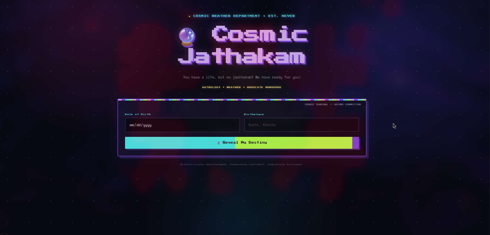
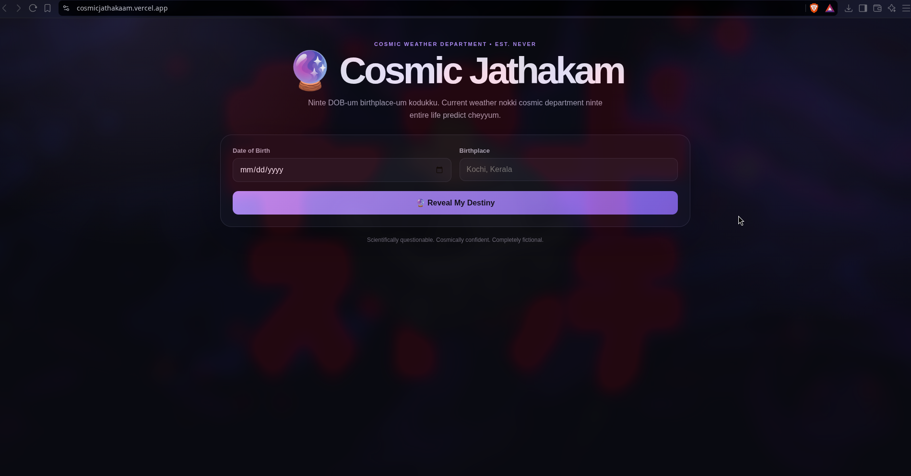
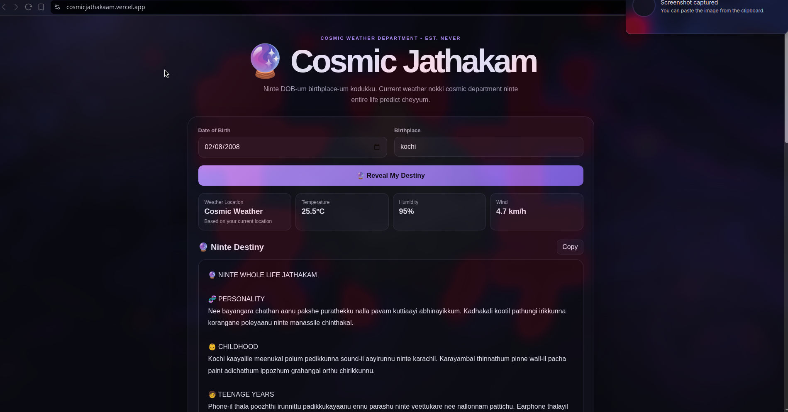
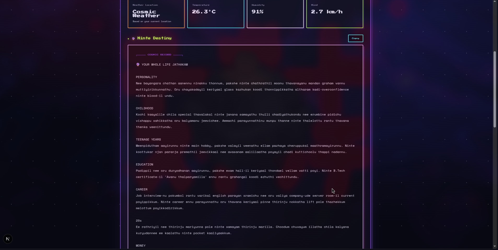

# CosmicJathakaam 🎯


## Basic Details
### Team Name: Gunda binu adholokam


### Team Members
-
- Member 1: Rajasri S - Model Engineering College, Thrikkakara
- Member 2: Aditya Sanjay - Model Engineering College, Thrikkakara

### Project Description- Cosmic Jaathakam
-It gives a whole dedicated personal horoscope based on the weather in your current location

### The Problem (that doesn't exist)
How to get a personalized jaathakam (horoscope) based on the weather ?

### The Solution (that nobody asked for)
Detects current location to fetch real time weather conditions. Based on that, itll generate a detailed horoscope, fully personalised.

# Technical Details

## Technologies/Components Used

### For Software:

**Languages**
- TypeScript
- JavaScript
- CSS
- HTML

**Frameworks**
- Next.js
- React

**Libraries / APIs**
- gemini api
- Open-Meteo Weather API
- Browser Geolocation API

**Tools**
- Git
- GitHub
- Vercel
- npm
- Visual Studio Code

### For Hardware:

**Not applicable.**

This project is completely software-based.

---


# Installation and Run
completely web based

### Project Documentation
For Software:
## initial design


## output looked like this at first



## final output



# Diagrams
### Software Architecture

```text
                     ┌──────────────────────┐
                     │      User            │
                     │                      │
                     │ DOB + Birthplace     │
                     └──────────┬───────────┘
                                │
                                ▼
                     ┌──────────────────────┐
                     │   Next.js Frontend   │
                     │   React + TypeScript │
                     └──────────┬───────────┘
                                │
                    Browser Geolocation
                                │
                                ▼
                     ┌──────────────────────┐
                     │   Next.js API Route  │
                     │   /api/jathakam      │
                     └──────────┬───────────┘
                                │
                    ┌───────────┴───────────┐
                    │                       │
                    ▼                       ▼
          ┌─────────────────┐    ┌────────────────────┐
          │  Open-Meteo     │    │   Hugging Face     │
          │  Weather API    │    │   Inference API    │
          └────────┬────────┘    └─────────┬──────────┘
                   │                       │
                   │ Weather Data          │ AI Generation
                   │                       │
                   └───────────┬───────────┘
                               │
                               ▼
                    ┌──────────────────────┐
                    │  Cosmic Jathakam     │
                    │                      │
                    │  Whole-Life          │
                    │  Horoscope           │
                    └──────────────────────┘ 
```
*Add caption explaining your workflow*


## Team Contributions
- Aditya Sanjay [dealt with the backend and apis]
- Rajasri S [frontend and css st]

---
Made with ❤️ at TinkerHub Useless Projects 


